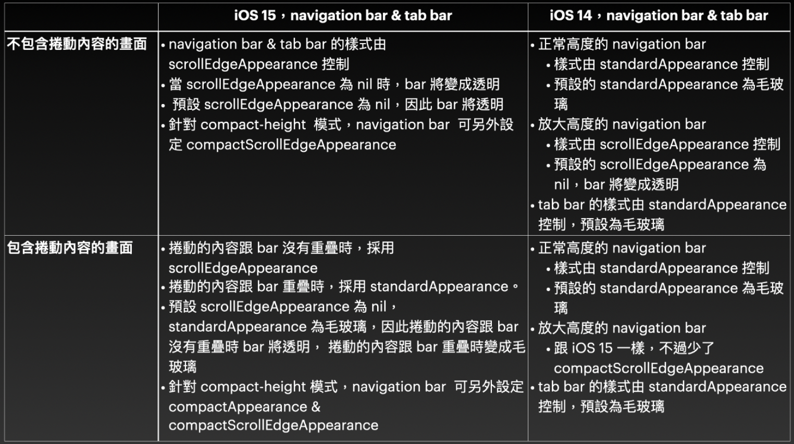
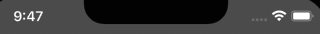
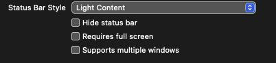
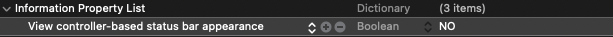

## UI介面筆記

- iOS 15 NavigationBar顯示方式（TabBar亦同）

  ```swift
  let barAppearance =  UINavigationBarAppearance() //初始化一個“BarAppearance”
  //設定NavigationBar裡的設定，跟原本設定方式相同
          barAppearance.backgroundColor = UIColor.darkGray
          barAppearance.titleTextAttributes = [NSAttributedString.Key.foregroundColor: UIColor.white]
          barAppearance.largeTitleTextAttributes = [NSAttributedString.Key.foregroundColor: UIColor.white]
  //設定三種狀態時的“BarAppearance”
          UINavigationBar.appearance().scrollEdgeAppearance = barAppearance
          UINavigationBar.appearance().standardAppearance = barAppearance
          UINavigationBar.appearance().compactAppearance = barAppearance
  ```

  參考圖：

  

- 設定 "Bar" 預設元件樣式

  

  1. TARGETS -> General -> Deployment Info -> Status Bar Style

     原本為 "default" 改為 "Light Content"

     

  2. Info.plist -> 新增 "View controller-based status bar appearance" 即完成

     

  

