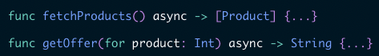
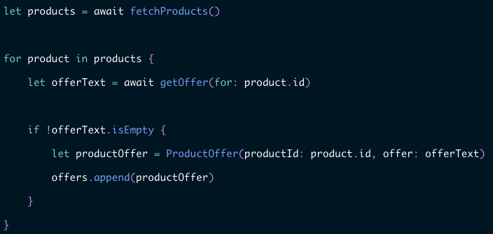
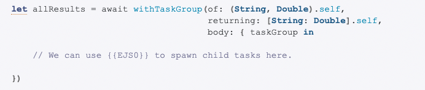

## async/await

### 版本

Swift 5.5 和 iOS 15 開始可用

### 作用

取代尾隨閉包，避免金字塔式程式碼。增加程式可讀性。

使用方式

1.將函式標記為異步函式 => 將關鍵字`async`放在函式返回型別之前

2.調用函式時，在前面加上關鍵字`await`。通過這樣的使用方式，程式會暫停當前執行，直到調用的函式執行完畢才會繼續執行。

依上述圖片為例，程式碼會在`let products = await fetchProducts()`暫停執行。直到調用韓式內容`fetchProducts()`執行完畢才會繼續往下執行。

### 參考網站

<https://auth0.com/blog/async-await-in-swift/>

## Task Group

### 版本

Swift 5.5 和 iOS 15 開始可用

### 作用

集合一組「並行執行」的子任務，在所有子任務 (child task) 執行完成後才會回傳結果。

### 特性

1. Task Group 是由一組獨立而非同步的任務（子任務）組成的。
2. Task Group 內所有子任務都會自動並行執行。
3. 我們無法控制子任務完成的時間。因此，**如果我們想子任務依特定次序完成，就不應該使用 Task Group**。
4. Task Group 只會在所有子任務完成後才會回傳結果。
5. Task Group 可能回傳一個數值、或一個 Void（沒有回傳數值）、又或是拋出一個錯誤。

### 建立Task Group 

- of => 子任務回傳的型別

- returning => Task Group回傳的型別
- Body => Task Group執行的閉包

範例程式參照『TaskGroup』

### 參考網站

<https://appcoda.com.tw/task-group/>

