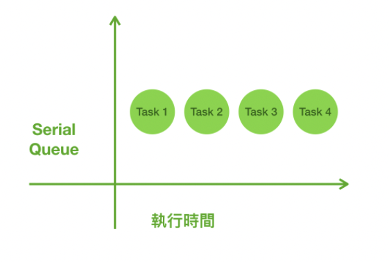
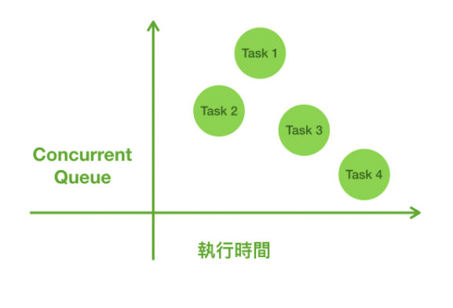
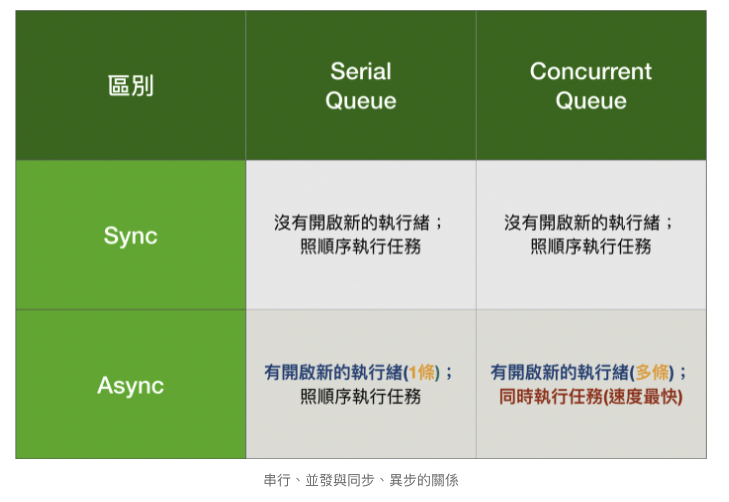

## GCD 多執行緒的說明與應用

---

GCD(Grand Central Dispatch) 是 Apple 將復雜的線程操作起來更容易使用的 API，雖然傳統的線程有限制，但整體執行也容易、安全。

總而言之，GCD為多執行緒的運用，其作用在於可將單一任務拆成多個小任務同時執行，亦或者同時執行多個任務，目的在於縮短執行任務的時間，而最重要的是，要確保不要佔用主執行緒而影響到使用者的體驗。

- Serial

  Serial Queues 的工作是按照順序，一次只執行當前一個。Serial Queues 適合拿來處理共享的資源，因為這樣可以確保執行完成是按照順序來的。

- Concurrent

  多個計算同時執行的特性。並發計算中涉及的**同時執行**，主要是若干個操作的開始和結束時間之間存在重疊。它並不關心具體的執行方式：我們可以把同一個線程中的多個操作交替運行(這需要這類操作能夠暫時被置於暫停狀態) 叫做並發，這幾個操作將會是分時運行的；我們也可以把在不同處理器核心中運行的任務叫做並發，此時這些任務必定是並行的。

  

### 同步與異步

- 同步（同步）

  **同步操作**意味著在操作完成之前，運行這個操作的線程都將被佔用，直到函數最終被拋出或者返回。

- 異步（非同步）

  把實際長時間執行的任務放到另外的線程(或者叫做後台線程) 運行，然後在操作結束時提供運行在主線程的回調。

